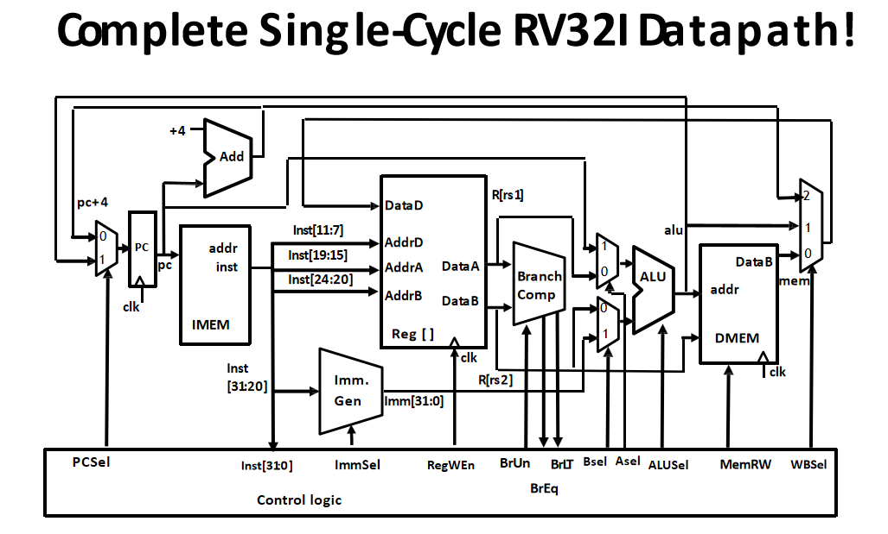

# RISC-V Single Cycle Processor

This project implements a single-cycle RISC-V processor in SystemVerilog. The processor supports a subset of the RISC-V instruction set architecture (ISA) and is designed for educational purposes to demonstrate the fundamental concepts of computer architecture.

## Architecture Overview

The processor follows the classic single-cycle datapath design where each instruction is executed in one clock cycle. The implementation includes all major components of a RISC-V processor:



## Project Structure

```
code/
├── RISCV_Single_Cycle.v    # Top-level module integrating all components
├── ALU.v                   # Arithmetic Logic Unit
├── ALU_decoder.v           # ALU control decoder
├── Branch_Comp.v           # Branch comparison unit
├── control_unit.v          # Main control unit
├── DMEM.v                  # Data memory module
├── IMEM.v                  # Instruction memory module
├── Imm_Gen.v              # Immediate generator
├── RegisterFile.v          # Register file (32 registers)
└── datapath.png           # Processor datapath diagram
```

## Module Descriptions

### RISCV_Single_Cycle.v
The top-level module that instantiates and connects all processor components. It manages the program counter (PC) and coordinates the instruction fetch-decode-execute cycle.

**Key Features:**
- Program counter management
- Instruction field decoding
- Component interconnection
- Clock and reset handling

### ALU.v
Implements the Arithmetic Logic Unit supporting various operations:
- Addition (`ADD`)
- Subtraction (`SUB`) 
- Bitwise AND (`AND`)
- Bitwise OR (`OR`)
- Bitwise XOR (`XOR`)
- Logical left shift (`SLL`)
- Logical right shift (`SRL`)
- Arithmetic right shift (`SRA`)
- Set less than signed (`SLT`)
- Set less than unsigned (`SLTU`)

### control_unit.v
The main control unit that generates control signals based on the instruction opcode and function fields. Supports:
- R-type instructions (register-register operations)
- I-type instructions (immediate operations, loads)
- S-type instructions (stores)
- B-type instructions (branches)
- U-type instructions (upper immediate)
- J-type instructions (jumps)

### RegisterFile.v
Implements the RISC-V register file with:
- 32 general-purpose registers (x0-x31)
- x0 hardwired to zero
- Dual read ports
- Single write port
- Synchronous write, asynchronous read

### IMEM.v & DMEM.v
Memory modules for instruction and data storage:
- **IMEM**: Read-only instruction memory
- **DMEM**: Read/write data memory with byte, halfword, and word access

### Imm_Gen.v
Immediate generator that extracts and sign-extends immediate values from different instruction formats (I, S, B, U, J types).

### Branch_Comp.v
Branch comparison unit that evaluates branch conditions:
- Equal (`BEQ`)
- Not equal (`BNE`)
- Less than (`BLT`)
- Greater than or equal (`BGE`)
- Less than unsigned (`BLTU`)
- Greater than or equal unsigned (`BGEU`)

### ALU_decoder.v
Decodes ALU control signals based on the main control unit's ALUOp and instruction function fields.

## Supported Instructions

The processor supports the following RISC-V instruction types:

### R-Type (Register-Register)
- `ADD`, `SUB`, `AND`, `OR`, `XOR`
- `SLL`, `SRL`, `SRA`
- `SLT`, `SLTU`

### I-Type (Immediate)
- `ADDI`, `ANDI`, `ORI`, `XORI`
- `SLLI`, `SRLI`, `SRAI`
- `SLTI`, `SLTIU`
- Load instructions: `LB`, `LH`, `LW`, `LBU`, `LHU`

### S-Type (Store)
- `SB`, `SH`, `SW`

### B-Type (Branch)
- `BEQ`, `BNE`, `BLT`, `BGE`, `BLTU`, `BGEU`

### U-Type (Upper Immediate)
- `LUI`, `AUIPC`

### J-Type (Jump)
- `JAL`, `JALR`

## Getting Started

### Prerequisites
- SystemVerilog-compatible simulator (ModelSim, Vivado, etc.)
- Basic understanding of RISC-V ISA
- Verilog/SystemVerilog knowledge

### Simulation
1. Load all `.v` files into your simulator
2. Set `RISCV_Single_Cycle` as the top-level module
3. Provide clock and reset signals
4. Load your program into instruction memory (IMEM)
5. Run simulation and observe outputs

### Testing
The processor can be tested with simple RISC-V assembly programs. Ensure your assembler generates machine code compatible with the supported instruction subset.

## Design Characteristics

- **Architecture**: Single-cycle implementation
- **Data Width**: 32-bit
- **Address Width**: 32-bit
- **Register File**: 32 × 32-bit registers
- **Memory**: Separate instruction and data memories
- **Pipeline**: None (single-cycle)

## Limitations

- Single-cycle design limits maximum clock frequency
- No pipeline hazard handling (not applicable)
- Limited instruction set (subset of RISC-V)
- No floating-point support
- No privileged mode instructions
- Fixed memory sizes

## Future Enhancements

- Pipeline implementation for better performance
- Cache memory integration
- Extended instruction set support
- Floating-point unit addition
- Exception and interrupt handling

## License

This project is for educational purposes. Please refer to your institution's policies regarding academic work.

## Contributors

Developed as part of computer architecture coursework.
